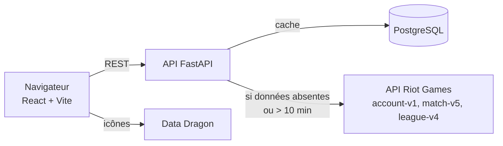

# Riot Stats

Tableau de bord League of Legends : rang, winrate, KDA, historique de parties et détail complet de chaque match, à partir d'un simple `pseudo#tag`.

L'API agrège les données de l'API officielle Riot Games et les met en cache dans PostgreSQL pour rester rapide et économe en appels.

<!-- Démo : https://ton-site.vercel.app -->
<!-- Capture d'écran : ajoute docs/apercu.png puis décommente la ligne suivante -->
<!--  -->

## Fonctionnalités

- Recherche d'un joueur par Riot ID, avec autocomplétion sur les joueurs déjà consultés
- Rang Solo/Duo et Flex avec emblèmes
- Winrate, KDA moyen et champion favori sur les 15 dernières parties, filtrables par mode de jeu
- Historique des parties (champion, KDA, CS/min, gold)
- **Détail d'un match** : les 10 joueurs avec items, sorts, runes, dégâts, vision et objectifs d'équipe. Un clic sur un pseudo ouvre son profil.

## Architecture



| Dossier | Contenu |
|---|---|
| [`riot-stats-api/`](riot-stats-api) | API FastAPI : `main.py` (routes), `riot_client.py` (appels Riot), `database.py` (PostgreSQL), `match_resume.py` (mise en forme d'un match), `rate_limit.py` |
| [`riot-stats-front/`](riot-stats-front) | Front React : `App.jsx` et `src/components/` |

## Choix techniques

- **Économie d'appels Riot.** La clé Riot est limitée à 100 requêtes / 2 min. L'API garde les joueurs (PUUID) et les matchs en base, et ne télécharge que les matchs nouveaux. Actualiser un profil déjà connu coûte **1 appel au lieu de 17**. Le JSON complet des matchs est stocké en `JSONB`, donc le détail d'un match ne rappelle jamais Riot.
- **Résilience.** Timeout sur chaque appel, nouvel essai automatique en respectant `Retry-After` sur les 429, erreurs Riot et réseau converties en messages clairs (404, 401, 429, 502, 503).
- **Sécurité.**
  - La clé Riot reste côté serveur.
  - La plateforme (`euw1`, `na1`…) est validée par liste blanche : elle sert à construire l'URL appelée avec la clé.
  - Un limiteur de requêtes par IP protège le quota.
  - Le CORS est configurable.
- **Tests.** 27 tests pytest sans réseau ni base, où Riot et PostgreSQL sont remplacés par des faux. La CI GitHub Actions lance les tests, le lint et le build du front, et construit l'image Docker.

## Lancer en local

**Prérequis :** une clé sur [developer.riotgames.com](https://developer.riotgames.com).

```bash
cp riot-stats-api/.env.example riot-stats-api/.env   # puis renseigner RIOT_API_KEY
```

### Avec Docker (API + PostgreSQL)

```bash
docker compose up --build
```

### Sans Docker

```bash
cd riot-stats-api
python -m venv venv && source venv/bin/activate     # Windows : venv\Scripts\activate
pip install -r requirements-dev.txt
uvicorn main:app --reload                            # PostgreSQL doit tourner (DATABASE_URL)
```

L'API est alors sur http://127.0.0.1:8000, avec sa documentation interactive sur `/docs`.

### Front

```bash
cd riot-stats-front
npm install
npm run dev                                          # http://localhost:5173
```

## Tests

```bash
cd riot-stats-api && pytest
cd riot-stats-front && npm run lint && npm run build
```

## Déploiement

1. **API + base (Render).**
   - Dans Render, choisir *New > Blueprint* puis ce dépôt. [`render.yaml`](render.yaml) crée l'API Docker et la base PostgreSQL.
   - Renseigner `RIOT_API_KEY` et `CORS_ORIGINS` (l'URL du front).
2. **Front (Vercel).**
   - Importer le dépôt avec `riot-stats-front` comme *Root Directory*.
   - Ajouter la variable `VITE_API_URL` (l'URL de l'API Render).
3. **Clé Riot.** La clé de développement expire toutes les 24 h. Pour une démo en ligne, il faut demander une *Personal API Key* sur le portail Riot.

> La base PostgreSQL gratuite de Render expire au bout de 30 jours. [Neon](https://neon.tech) est une alternative gratuite : il suffit de changer `DATABASE_URL`.

---

Riot Stats n'est pas affilié à Riot Games. League of Legends et Riot Games sont des marques déposées de Riot Games, Inc.
